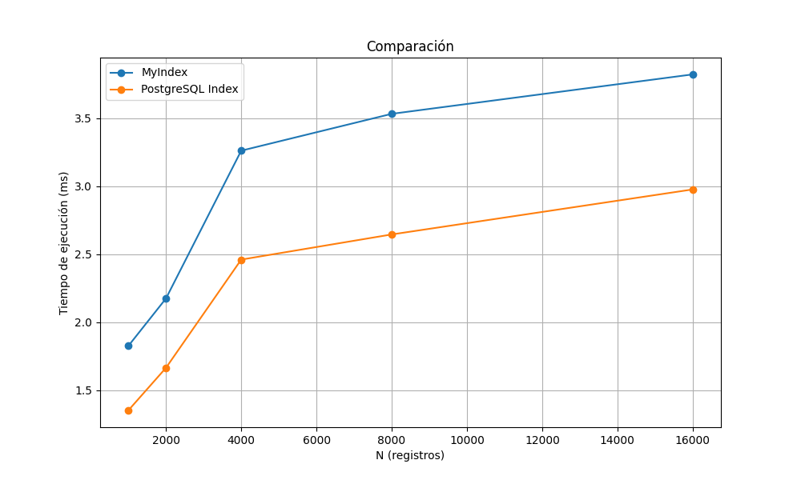
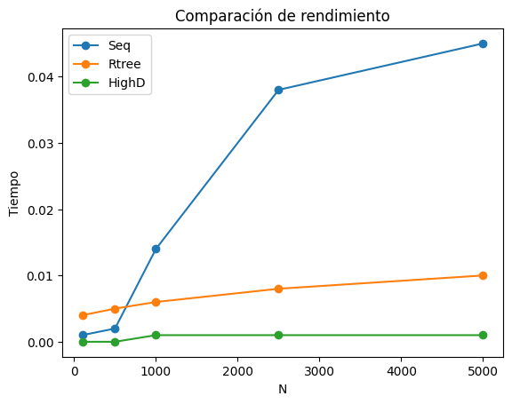

# PROYECTO FINAL 2 Y 3 BASE DE DATOS II 
  <p align="center">
  
  </p>
  
## Organización del equipo

|            Participante             |   Rol   |
|:-----------------------------------:|:---------:|
|  Stuart Diego Arteaga Montes        |  Backend  |
|  Johan Fabian Callinapa Chunga      |  Frontend|
|  Dimael Rivas                        | Backend |
|  Kelvin Andrei Cahuana Condori       | Backend |

## Proyecto parte 2 
  
 ## Introduccion
  
En la era digital, encontrar canciones similares representa un desafío debido a la inmensa variedad de música disponible y la subjetividad en gustos musicales. A pesar de los avances tecnológicos, la búsqueda se ve obstaculizada por la complejidad de la percepción auditiva y las diferencias individuales, lo que hace que identificar similitudes musicales sea una tarea compleja y fascinante a la vez.
 
 ### Objetivo del proyecto
 El objetivo del proyecto es realizar consultas eficientes ya sea de manera textual o en formato de audio. Por medio, de indices invertidos (SPIMI) y multidimensionales (R-tree, Faiss, etc). En este sentido, se plantea por el lado de busquedas textuales, evaluar la eficiencia entre un indice de PostgreSql y nuestra implementacion, y por el otro lado, ver cual indice multidimensional se acopla mas a la busqueda.|
 ### Dominio de datos
#### Para busquedas textuales:
El dominio de datos esta definido por la siguiente conjunto de datos: [Spotify Songs](https://www.kaggle.com/datasets/imuhammad/audio-features-and-lyrics-of-spotify-songs), el cual esta en el formato de un csv y definido por el siguiente datacard:


| Variable                     | Class      | Description                                                                                                                |
|------------------------------|------------|----------------------------------------------------------------------------------------------------------------------------|
| track_id                     | character  | Song unique ID                                                                                                             |
| track_name                   | character  | Song Name                                                                                                                  |
| track_artist                 | character  | Song Artist                                                                                                                |
| lyrics                       | character  | Lyrics for the song                                                                                                                                                                                                                                                                                                        |                                  
|...                                          |...|...
| duration_ms                  | double     | Duration of song in milliseconds                                                                                            |
| language                     | character  | Language of the lyrics                                                                                                      |
 Este dataset cuenta con 18,000 canciones de Spotify
 #### Para busquedas con formato de audio
 Por medio del uso de la api de [spotify](https://github.com/spotify-api/spotify-api.js/) y la biblioteca [spotdl](https://github.com/spotDL/spotify-downloader) se lograron descargar un conjunto de canciones de tamaño 5000.
 Cabe resaltar que ambos datasets no se limitan a un solo idioma, y para mas informacion de como se logro descargar las canciones, vea la parte 3.
 ## Busqueda textual
 ### Construccion del indice invertido
 #### Preprocesamiento
 Antes realizar la construccion del indice invertido, se realiza una union de los atributos de cada fila del dataset. 
 ##### Eliminacion de stopwords
 Por medio de la libreria ```nltk``` filtramos todos los stopwords, con el fin de obtener mayor informatividad. Cabe resaltar que no se hacer un stem a la palabras ya que se desea una precision adecuada.
```invert_index.py```
 ```python
def eliminarStopWords(tokenText):
    print(os.getcwd())
    customSW = open(os.path.join(os.path.dirname(__file__), 'stop_words_italian.txt'), 'r')
    palabras_stoplist = customSW.read()
    customSW.close()
    palabras_stoplist = nltk.word_tokenize(palabras_stoplist.lower())
    stoplist = ["0","1","2","3","4","5","6","7","8","9","_","--", "\\",
                "^",">",'.',"@","=","$" , '?', '[', ']', '¿',"(",")",
                '-', '!',"<", '\'',',', ":","``","''", ";", "»", '(-)',
                "+","0","/", "«", "{", "}", "--", "|","`","~","'","...","..","-",".....","—","'","-","“","…", "‘","#","&","%"]
    palabras_stoplist += stoplist
    # Solo eliminar las palabras de parada, sin aplicar el stemmer
    resultado = [token for token in tokenText if (token not in palabras_stoplist)]

    return resultado
    
def preprocesar_textos(texto):
    tokenText = tokenizar(texto)
    tokensLst = eliminarStopWords(tokenText)

    return tokensLst
 ```
#### Construccion del indice invertido

Dentro de las diferente maneras de implementar un indice invertido, usaremos un spimi, ya que consideramos que es uno de los mas eficientes.
  <p align="center">
  
  </p>

Dado a la gigantesca cantidad de datos, separamos la datas en bloques ```(bloques{language})``` , cada bloque tiene una capacidad de 20000 DocId:Freq

```python
def SPIMIConstruction(self):
        data = self.loadData()
        dictTerms = defaultdict(list)
        block_n = 1

        for idx, row in data.iterrows():
            if idx % 20000 == 0: print("Estamos en el index ", idx)
            abstract = row["concatenated"]
            docID = row["track_id"]
            tokensAbstract = preprocesar_textos(abstract)
            #Crear postingList
            term_freq = defaultdict(int)
            for term in tokensAbstract:
                term_freq[term] += 1

            for term, freq in term_freq.items():
                if sys.getsizeof(dictTerms) > self.BLOCK_LIMIT:
                    sorted_block = sorted(dictTerms.items(), key=itemgetter(0))
                    block_name = "bloque-"+str(block_n)+".txt"
                    block_path = os.path.join(blocks_dir, block_name)
                    with open(block_path, "w") as file_part:
                        json.dump(sorted_block, file_part, indent=2)
                    sorted_block = {} #clear
                    block_n += 1
                    dictTerms = defaultdict(list) #clear
                dictTerms[term].append((docID, freq))
```
Acciones:
1.- Extrae la data
2.- Calcula la frecuencia de cada termino de cada fila en el orden de entrada y lo almacena en un bloque correspondiente

Una vez ya distribuida la data, se realiza la union de los bloques locales para de esta manera obtener un indice inverso global
```python
def index_blocks(self):
        blocks = []
        files = self.listFiles()
        for file_path in files:
            with open(file_path, 'r', encoding='utf-8') as file:
                block = json.load(file)
                blocks.append(block)

        while 1 < len(blocks):
            merged_blocks = []
            for i in range(0,len(blocks), 2):
                if i+1 <len(blocks): #si ya no hay mas con que agarrar, o sea el ultimo
                    combinados = self.merge(dict(blocks[i]), dict(blocks[i+1]))
                    merged_blocks.append(combinados)
                else:#solo append al final
                    merged_blocks.append(blocks[i])
            blocks = merged_blocks #actualiza el nuevo merge
        ordenar_merge = OrderedDict(sorted(blocks[0].items(), key=lambda x: x[0]))
        return ordenar_merge
```
Acciones:
1.- Se empieza a leer bloque por bloque
2.- Se juntan los bloques con el fin de generar un indice global


### Consultas / Busqueda
En este proyecto para el calculo de similitud usamos los pesos ```TF-IDF```, cuales procedimientos de calculo se encuentran en ```invert_index.py```, pero en general este es el procedimiento:

1.  **Carga de datos y del índice invertido**
2.  **Preprocesamiento de la consulta**
3.  **Cálculo de TF-IDF de la consulta**
4.  **Generación de vectores de características**
5.  **Cálculo de similitud de coseno**
6.  **Ordenamiento de documentos por similitud de coseno**
7.  **Obtención de los top k resultados**
```python
def calculate_tf(query, document):
    term_frequency = document.count(query)
    return (1+math.log10(term_frequency))

def calculate_idf(query, documents):
    document_frequency = sum(1 for document in documents if query in document)
    return math.log(len(documents) / (document_frequency + 1))
```
Una vez ya obtenido DocID:TF-IDF, se puede empezar a aplicar las busquedas por similitud. Cabe resaltar que la metrica que estamos usando es la de un cosine.
```python
def cos_Similarity(self, query, cosine_docs):
        cosine_scores = defaultdict(float)
        for docId in cosine_docs:
            doc = cosine_docs[docId]
            q = query
            sum_ = 0
            sum_ += round(np.dot(q/(np.linalg.norm(q)),doc/(np.linalg.norm(doc))),5)
            cosine_scores[docId] = sum_
        return cosine_scores
 ```
 En este sentido, con las funciones ya implementadas, podemos definir a nuestro topk como:
 ```python
  def retrieve_k_nearest(self, query, k, language):
        ...
        for term in query:
            term_data = self.binary_search(term, index_data)
            if term_data is None:
                continue
            idf_query[term] = round(math.log10((len(data)/len(term_data)) + 1),4)
            for docId_tfidfin in term_data:
                docId = docId_tfidfin.split(",")[0]
                tf_idf = docId_tfidfin.split(",")[1]
                cos_to_evaluar[docId][term] = tf_idf
                # va guardando en cada doc, el tf idf en orden de los querys keywords
            tf_ = calculate_tf(term, query)
            idf_ = idf_query[term]
            query_tfidf.append(tf_*idf_)

        #Crear vectores caracteristicos
        cosine_docs = defaultdict(list)

        for docId in cos_to_evaluar:
            for term in query:
                if term in cos_to_evaluar[docId]:
                    cosine_docs[docId].append(float(cos_to_evaluar[docId][term]))
                else:
                    cosine_docs[docId].append(0)

        scores = self.cos_Similarity(query_tfidf, cosine_docs)

        # Ordenar los documentos por puntuación de similitud de coseno en orden descendente
        scores = sorted(scores.items(), key=lambda kv: kv[1], reverse=True)
        scores = scores[:k]
        return data.iloc[matching_indices], scores_values, execution_time
 ```
### Diseño del índice con PostgreSQL
```python
def create_index(lang, tablename='public.music'):
    conn = psycopg2.connect(
        host=getenv("HOST"),
        port=getenv("PORT"),
        dbname=getenv("DBNAME"),
        user=getenv("USER"),
        password=getenv("PASSWORD")
    )

    cursor = conn.cursor()
    cursor.execute('CREATE EXTENSION IF NOT EXISTS pg_trgm;')

    cursor.execute(f"ALTER TABLE {tablename} ADD COLUMN indexed tsvector;")
    cursor.execute(f"""UPDATE {tablename} SET indexed = T.indexed FROM (
                    SELECT id, setweight(to_tsvector('{lang}', name), 'A') || setweight(to_tsvector('{lang}', content), 'B') AS indexed FROM {tablename}
                   ) AS T WHERE {tablename}.id = T.id;""")
    cursor.execute(f'CREATE INDEX IF NOT EXISTS content_idx_gin ON {tablename} USING gin (indexed);')

    conn.commit()
    cursor.close()
    conn.close()
```
### Experimentación
### Tablas y gráficos de los resultados
Tiempo de ejecución promedio en ms.
| N (registros) | PostgreSQL Index | MyIndex |
|-----------|-----------|-----------|
| 1000   | 1.351            | 1.825   |
| 2000   | 1.664            | 2.174   |
| 4000   | 2.460            | 3.261   |
| 8000   | 2.645            | 3.532   |
| 16000  | 2.976            | 3.822   |



### Conclusión
* Se realizó un uso de memoria eficiente para la construción del índice invertido
* Se creo el índice de postgres considerando distintos pesos, se dio más peso al nombre del producto que al contenido (todos los demás campos concatenados).
* Al realizar la comparación de tiempos de ejecución se evidencio que el índice de postgres es mejor que el nuestro.
  
## Proyecto parte 3


### Obtención de links de canciones 
```python

from spotipy.oauth2 import SpotifyClientCredentials
import spotipy

CLIENT_ID = "3f54e3fbacdc45d3bedabd32238802e8"
CLIENT_SECRET = "e5c73a13fc0c47efb49c7bb054f0383b"

def buscar_cancion(artista, titulo_cancion):
    if not artista:
        print("Error: El nombre del artista está vacío.")
        return

    artista = artista.upper()
    sp = spotipy.Spotify(client_credentials_manager=SpotifyClientCredentials(CLIENT_ID, CLIENT_SECRET))
    query = f"{titulo_cancion} {artista}"  
    resultado_busqueda = sp.search(query, type='track', limit=1)

    if resultado_busqueda['tracks']['items']:
        track_uri = resultado_busqueda['tracks']['items'][0]['external_urls']['spotify']
        return track_uri
    else:
        print("No se encontró la canción en Spotify.")

```
### Descarga de canciones

```python

def descargar(artista,name):
    spotify_track_url = buscar(artista,name)
    comando_spotdl = f"spotdl {spotify_track_url}"
    try:
        output = subprocess.check_output(comando_spotdl, shell=True, text=True)
        print(output)
    except subprocess.CalledProcessError as e:
        print("Error al descargar la pista:", e)

```

```python

with open('spotify.csv', 'r', encoding='utf-8') as csv_file:
    csv_reader = csv.DictReader(csv_file)
    for row in csv_reader:
        artista=row['track_name']
        name=row['track_artist']
        idioma_track=row['language']
        if idioma_track in idiomas_mapeados:
            nombre_archivo = os.path.join(idioma_track)
        else:
            nombre_archivo = os.path.join('en')
        os.chdir(nombre_archivo)
        descargar(artista, name)
        os.chdir(directorio_original)
```      
* Se usó la librería spotdl para la desarga de canciones.
* Cabe mencionar que para este proyecto se descargo 5000 canciones entre los 5 idiomas que se usaron en el indice invertido de la parte 2.

### Features Songs
Primero capturamos el audio :
```python
    audio, sr = librosa.load(file_path, mono=True)
```  
Para la **extración de características** se uso la librería **librosa** de python y rescatamos 5 distintos tipos de características y son las siguientes:
#### Contraste Espectral
Mide la diferencia en amplitud entre los picos y valles en el espectro.
```python
    contrast = librosa.feature.spectral_contrast(y=audio, sr=sr)
```
#### Croma
Representa la distribución de energía de las notas en el espectro musical. Calcula un croma a partir de una transformada de Fourier de corto tiempo (STFT).
```python
 chroma = librosa.feature.chroma_stft(y=audio, sr=sr)
```
#### Tonnetz
Representa el tono de una señal de audio.
```python
    tonnetz = librosa.feature.tonnetz(y=audio, sr=sr)
```
#### Tempograma
Representa el tempo estimado de una señal de audio.
```python
    tempo, tempogram = librosa.beat.beat_track(y=audio, sr=sr)
```
#### Coeficientes MFCC (Mel-Frequency Cepstral Coefficients):
Representan la forma en que el espectro de frecuencia de una señal de audio varía con el tiempo.
```python
    tempo, tempogram = librosa.beat.beat_track(y=audio, sr=sr)
```
Ademas se uso sus variaciones 
##### Delta MFCC y Delta Delta MFCC
Representan las tasas de cambio de los coeficientes MFCC a lo largo del tiempo.

```python
    delta_mfccs = librosa.feature.delta(mfccs)
    delta2_mfccs = librosa.feature.delta(mfccs, order=2)
```

Y para extraer todas estas características de una canción se uso la siguiente función
```python
def extract_features(file_path, max_length=1000):
    audio, sr = librosa.load(file_path, mono=True)
    mfccs = librosa.feature.mfcc(y=audio, sr=sr, n_mfcc=20)
    mfcc_features = np.concatenate((mfccs.mean(axis=1), mfccs.std(axis=1)))
    delta_mfccs = librosa.feature.delta(mfccs)
    delta_mfcc_features = np.concatenate((delta_mfccs.mean(axis=1), delta_mfccs.std(axis=1)))
    delta2_mfccs = librosa.feature.delta(mfccs, order=2)
    delta2_mfcc_features = np.concatenate((delta2_mfccs.mean(axis=1), delta2_mfccs.std(axis=1)))
    chroma = librosa.feature.chroma_stft(y=audio, sr=sr)
    contrast = librosa.feature.spectral_contrast(y=audio, sr=sr)
    tonnetz = librosa.feature.tonnetz(y=audio, sr=sr)
    tempo, tempogram = librosa.beat.beat_track(y=audio, sr=sr)
    all_features = np.concatenate((
        mfcc_features,
        delta_mfcc_features,
        delta2_mfcc_features,
        chroma.mean(axis=1),
        contrast.mean(axis=1),
        tonnetz.mean(axis=1),
        tempogram
    ))
    if len(all_features) < max_length:
        all_features = np.pad(all_features, (0, max_length - len(all_features)))
    else:
        all_features = all_features[:max_length]
    return all_features
```
* Se limitó a  1000 características por canción
Este proceso se realizó para todas las canciones de la siguiente manera
```python
ruta_carpeta = "spotify/CANCIONES"
caracteristicas = []
etiquetas = []
for archivo in archivos_carpeta:
    ruta_archivo = os.path.join(ruta_carpeta, archivo)
    features = extract_features(ruta_archivo)
    caracteristicas.append(features)
    etiquetas.append(archivo)

```
Todos estos feautures se guardaron en un archivo csv 
```python
etiquetas = np.array(etiquetas)
df = pd.DataFrame(data=caracteristicas)
df['etiqueta'] = etiquetas
df.to_csv('spotify/caracteristicas.csv', index=False)
```

### Implementación de busquedas :


Para poder realizar las búsquedas propuestas se abrió el archivo csv, previamente mencionado y se dividió entre etiquetas y caracteristicas además se normalizaron los datos para un mejor resultado.

```python
data = pd.read_csv('caracteristicas.csv')
X = data.iloc[:, :-1].values
scaler = StandardScaler()
X = scaler.fit_transform(X)
```

#### KNN SECUENCIAL CON PRIORITY QUEUE:

```python
def knn_search_priority_queue(query, k):
    similarities = cosine_similarity(query.reshape(1, -1), X).flatten()
    priority_queue = PriorityQueue()
    for i, sim in enumerate(similarities):
        priority_queue.put((-sim, data.iloc[i]['Nombre']))  
    vecinos = []
    for i in range(k):
        sim, neighbor = priority_queue.get()
        vecinos.append((neighbor, -sim))
    return vecinos
```

#### KNN POR RANGO :
```python
def range_search(query_object, radius):
    query_object_2d = query_object.reshape(1, -1)
    within_radius = [(euclidean_distances(query_object_2d, X[i].reshape(1, -1))[0, 0], data.iloc[i]['Nombre']) for i in range(len(X)) if euclidean_distances(query_object_2d, X[i].reshape(1, -1))[0, 0] <= radius]
    return within_radius
```

#### KNN RTREE :
* Para esta parte , el índice RTREE no soporta vectores de mucha dimensionalidad , así que la solucion que planteamos es usar un algoritmo de reducción de dimensionalidad llamado PCA, lo convertimos a una dimensión de 500.

```python
def reducir_dimensionalidad(data):

    new_data = []
    for i in range(len(data)):
        new_data.append(data.iloc[i][:-1])
    scaler = StandardScaler()
    data_scaled = scaler.fit_transform(new_data)
    pca = PCA(n_components=500)
    data_pca = pca.fit_transform(data_scaled)
    new_data_pca =[]
    for i in range(len(data_pca)):
        temp=list(data_pca[i])
        temp.append(data.iloc[i][len(data.iloc[0])-1])
        new_data_pca.append(temp)
    return new_data_pca

```
* Implemetación
```python
class RtreeIndex:
    def __init__(self,c):
        p = index.Property()
        p.dimension = 500
        self.collection = c
        self.core = index.Index(properties=p)
        for itr in range(len(self.collection)):
            self.core.insert(id=itr,coordinates=self.collection[itr][:-1])
    def knn_rtree(self,query,k):
        ans = []
        result = self.core.nearest(coordinates=query[:-1],num_results=k)
        for itr in result:
            ans.append((self.collection[itr][len(self.collection[itr])-1],itr))
        return ans
```

#### Búsqueda usando la librería faiss :


FAISS es una biblioteca desarrollada por Facebook para la búsqueda eficiente de similitudes en grandes conjuntos de datos. Está especialmente diseñada para trabajar con vectores de alta dimensionalidad, como los que se encuentran comúnmente en problemas de aprendizaje profundo y recuperación de información. A continuación, se presentan algunos aspectos clave de la biblioteca FAISS:
1. Recuperación de Similitud:
FAISS está diseñada para realizar operaciones eficientes de búsqueda de similitudes en grandes conjuntos de datos. Puede encontrar los vecinos más cercanos de un vector dado en un espacio de características de alta dimensión.
2. Índices de Recuperación:
FAISS implementa varios índices de recuperación que son eficientes para diferentes tipos de datos y patrones de acceso. Algunos de estos índices incluyen el índice de búsqueda binaria (Binary Flat), el índice IVF (Inverted File), y otros índices específicos para datos de alta dimensión.
3. Soporte para GPU:
Una de las características distintivas de FAISS es su capacidad para aprovechar GPU para acelerar la búsqueda de similitudes. Esto es crucial para manejar grandes conjuntos de datos y dimensiones elevadas de manera eficiente.
4. Algoritmos Optimizados:
FAISS implementa algoritmos optimizados para la búsqueda eficiente en espacios de alta dimensión. Esto incluye métodos para reducir el costo computacional de operaciones como la distancia euclidiana en dimensiones elevadas.

Indexación :
```python
import  faiss
X = data.iloc[:, :-1].values.astype('float32')  
scaler = StandardScaler()
X = scaler.fit_transform(X)
dimension = X.shape[1]  
nlist = 10
quantizer = faiss.IndexFlatL2(dimension)
index = faiss.IndexIVFFlat(quantizer, dimension, nlist, faiss.METRIC_L2)
index.train(X)
index.add(X)
```
Búsqueda:
```python
def knn_faiss(query_object, k):
    query_object = query_object.astype('float32')
    distances, indices = index.search(np.expand_dims(query_object, axis=0), k)
    return [(distances[0][i], data.iloc[indices[0][i]]['Nombre']) for i in range(k)]
```
* Para esta implementación se uso el índice **IndexIVFFlat**, aquí hay una explicación de cómo funciona el índice IndexIVFFlat:
1. Creación del Cuantizador (Quantizer):
Primero, se debe crear un cuantizador, que es responsable de asignar un vector de datos a uno de los centroides (grupos) en el índice plano. En el ejemplo proporcionado, se utiliza IndexFlatL2 como cuantizador, lo que significa que los vectores se asignarán a los centroides basándose en la distancia euclidiana.
2. Creación del Índice IVF:
Luego, se crea el índice IVF (IndexIVFFlat) utilizando el cuantizador. Este índice IVF divide el espacio de búsqueda en grupos (o celdas) utilizando el cuantizador. Cada grupo contiene un conjunto de vectores.
3. Parámetros Importantes:
quantizer: El cuantizador que se utilizará para asignar vectores a grupos.
dimension: La dimensionalidad de los vectores de características.
nlist: El número de centroides (grupos) en el índice IVF.
metric: La métrica de distancia utilizada para medir la similitud entre vectores. En el ejemplo, se utiliza la distancia euclidiana (faiss.METRIC_L2).
4. Entrenamiento del Índice:
Antes de utilizar el índice para búsquedas, se puede entrenar. El entrenamiento ayuda al índice a aprender estructuras internas que facilitan las futuras búsquedas de vecinos más cercanos.
5. Añadir Datos al Índice:
Después del entrenamiento (si es necesario), se añaden los datos al índice utilizando el método add. Esto permite que el índice construya las estructuras internas necesarias para facilitar la búsqueda eficiente.

### Experimentación  

| N     | Seq   | Rtree | HighD |
| ----- | ----- | ----- | ----- |
| 100  | 0.001 | 0.001 | 0.000 |
| 500   | 0.002 | 0.001 | 0.001 |
| 1000  | 0.014 | 0.007 | 0.001 |
| 2500  | 0.038 | 0.022 | 0.001 |
| 5000 | 0.050 | 0.066 | 0.001 |



### Conclusiones:
* El índice que ofrece la librería faiss es mejor a comparación de los implementados.
* Rtree es muy deficiente para dimensionalidades altas.
* Knn con prioridad es una buena idea si se desea una implementación simple.


